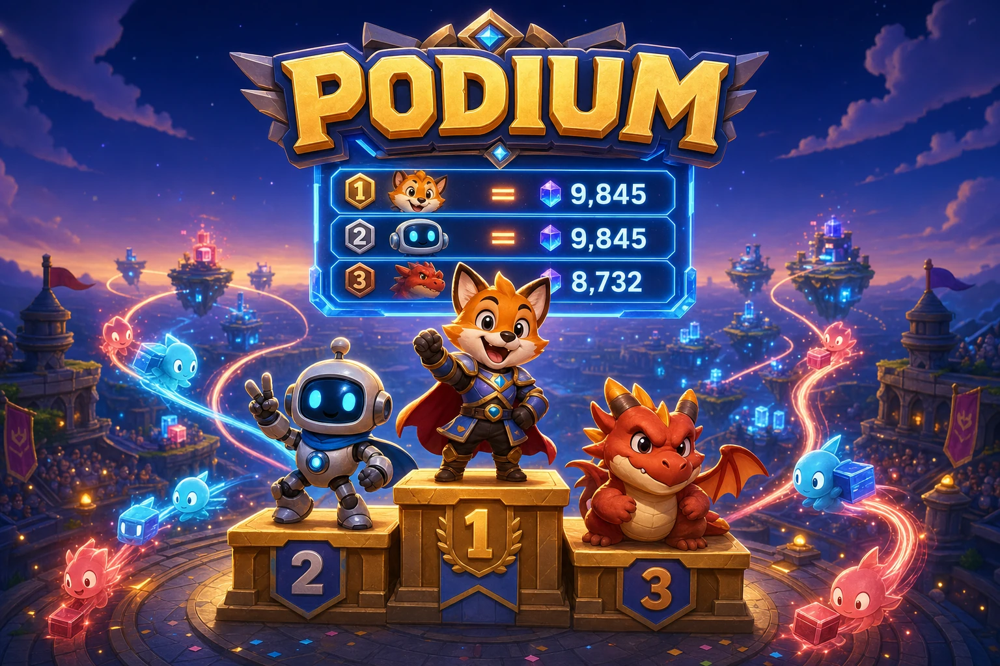

# Podium

[](https://github.com/TeneficGames/podium/actions/workflows/ci.yml)
[](https://codecov.io/gh/TeneficGames/podium)



**High-performance, Redis-backed leaderboards for games and competitive
applications.**

Podium provides ready-to-run HTTP and gRPC APIs for scores, ranks, seasons, and
player-relative views. It is designed for backend teams operating large fleets
of independent leaderboards without provisioning each leaderboard in advance.

- Fair, deterministic ordering when scores are equal.
- Single and bulk score updates, including multi-leaderboard fan-out.
- Standalone Redis and real Redis Cluster integration coverage.
- Deploy one multi-architecture OCI image with Docker, containerd, Kubernetes,
  or another OCI-compatible runtime.

[Quickstart](#quickstart) · [Performance](#performance) ·
[API](docs/API.md) · [Documentation](docs/overview.md) ·
[Helm chart](charts/podium/README.md) ·
[Docker Hub](https://hub.docker.com/r/trungdlp/podium) ·
[GHCR](https://github.com/orgs/TeneficGames/packages/container/package/podium)

## Quickstart

Start Redis 8.2 and the latest stable Podium image:

```bash
docker network create podium
docker run --detach --name podium-redis --network podium redis:8.2-alpine

docker run --detach --rm --name podium \
  --network podium \
  --publish 8880:8880 \
  --publish 8881:8881 \
  --env PODIUM_REDIS_HOST=podium-redis \
  --env PODIUM_REDIS_PORT=6379 \
  trungdlp/podium:latest start
```

Verify the service:

```bash
curl http://localhost:8880/healthcheck
```

```text
WORKING
```

Submit two equal scores:

```bash
curl --request PUT \
  --header 'Content-Type: application/json' \
  --data '{"score":100}' \
  http://localhost:8880/l/weekly-global/members/player-a/score

curl --request PUT \
  --header 'Content-Type: application/json' \
  --data '{"score":100}' \
  http://localhost:8880/l/weekly-global/members/player-b/score
```

Retrieve the leaders:

```bash
curl 'http://localhost:8880/l/weekly-global/top/1?pageSize=10'
```

`player-a` ranks above `player-b` because it reached the current score first.

Use `trungdlp/podium:latest` for the latest stable release or
`trungdlp/podium:edge` to track `main`. Versioned aliases are also published
for deployments that require controlled upgrades.

## Why Podium?

- **No provisioning:** a leaderboard exists as soon as its first score is
  submitted.
- **Many leaderboard types:** use names to separate global, regional, clan,
  event, seasonal, or game-specific rankings.
- **Flexible reads:** query top pages, top percentages, individual ranks,
  members around a player, or members around a score.
- **Efficient writes:** set or increment one score, update many members, or
  update one member across many leaderboards.
- **Deterministic ties:** rank equal scores by arrival at the current score,
  not by an arbitrary player ID.
- **Expiration:** expire a whole seasonal leaderboard or individual member
  scores.
- **Production interfaces:** HTTP/JSON and gRPC from the same container image.
- **Observability:** OpenTelemetry traces and metrics over OTLP/gRPC, with
  optional Sentry error reporting.

## Performance

These are sequential end-to-end HTTP operations through Podium and a local
Redis 8.2 instance. Results are five-run medians recorded on July 30, 2026,
using Go 1.26.5 and an Apple M4 Pro.

| Operation | Median | Allocated bytes |
| --- | ---: | ---: |
| Set one member score | 305 µs | 6.7 KB |
| Set 50 member scores | 657 µs | 36.1 KB |
| Get one member rank | 282 µs | 5.4 KB |
| Get a top-members page | 441 µs | 9.5 KB |
| Update one member across 100 leaderboards | 3.58 ms | 78.3 KB |
| Get 501 members | 3.17 ms | 222.6 KB |

Each benchmark invocation uses isolated leaderboard IDs and removes its data
afterward. Setup and cleanup are outside the timed operation.

In direct Redis strategy benchmarks, deterministic ordering added about 11% for
inserts, 17% for score changes, 5% for idempotent score submissions, 1% for
rank reads, and 3% for top-50 reads compared with a plain sorted set. Supporting
the same arrival order for both ascending and descending leaderboards used
about 287 Redis bytes per member versus 99 bytes for the plain baseline. In the
end-to-end HTTP suite, a 501-member bulk lookup was approximately 78% slower
than the pre-tie-break implementation and remains an optimization target.

<details>
<summary>Full Go benchmark medians</summary>

```text
BenchmarkSetMemberScore-14                           3894        305184 ns/op       0.41 MB/s        6657 B/op         80 allocs/op
BenchmarkSetMembersScore-14                          1834        657072 ns/op       8.49 MB/s       36064 B/op        336 allocs/op
BenchmarkIncrementMemberScore-14                     3645        315205 ns/op       0.40 MB/s        6643 B/op         80 allocs/op
BenchmarkRemoveMember-14                             3973        294295 ns/op       0.10 MB/s        5429 B/op         68 allocs/op
BenchmarkGetMember-14                                3688        292886 ns/op       0.36 MB/s        5413 B/op         67 allocs/op
BenchmarkGetMemberRank-14                            4112        281604 ns/op       0.21 MB/s        5382 B/op         68 allocs/op
BenchmarkGetAroundMember-14                          2077        572332 ns/op       2.62 MB/s        9657 B/op         71 allocs/op
BenchmarkGetTotalMembers-14                          4531        264758 ns/op       0.11 MB/s        5278 B/op         65 allocs/op
BenchmarkGetTopMembers-14                            2652        440669 ns/op       3.40 MB/s        9531 B/op         69 allocs/op
BenchmarkGetTopPercentage-14                         2808       1034887 ns/op      20.21 MB/s       80142 B/op         80 allocs/op
BenchmarkSetMemberScoreForSeveralLeaderboards-14      320       3581346 ns/op       5.17 MB/s       78344 B/op        101 allocs/op
BenchmarkGetMembers-14                                429       3172862 ns/op      16.17 MB/s      222581 B/op         86 allocs/op
```

</details>

These measurements use one local Redis instance and are not Redis Cluster
capacity results. See the [benchmark guide](docs/benchmark.md) for the
reproducible commands and interpretation rules.

## Scaling model

Podium keeps leaderboard state in Redis, allowing multiple API replicas to
serve the same leaderboard fleet behind a load balancer.

With Redis Cluster enabled, different leaderboard IDs distribute across
cluster slots. The ascending and descending score indexes, member metadata,
sequence, and expiration keys
for one leaderboard share a Redis hash tag, keeping its atomic Lua operations
on one slot. CI validates this behavior against a real three-primary Redis 8.2
Cluster covering all 16,384 slots.

Multi-leaderboard writes use no more than 32 workers per request, bounding
in-process fan-out concurrency.

Redis Cluster scales across independent leaderboards; it does not divide one
sorted set across shards. One exceptionally hot or large leaderboard remains
limited by the Redis primary that owns its slot. Partition that workload at the
application level when it must exceed one node's capacity.

## Deterministic ties versus upstream

The upstream [`topfreegames/podium`](https://github.com/topfreegames/podium)
stores public member IDs directly in a Redis sorted set. Redis consequently
orders equal scores lexicographically by member ID.

This fork assigns a monotonic Redis sequence whenever a member reaches a new
score:

- The member who reached the current score first ranks higher.
- Repeating the same score preserves the member's position.
- Leaving a score and returning later creates a new arrival behind members
  already at that score.
- Removing and re-adding a member also creates a new arrival.

Redis commits the score update, sequence assignment, and resulting rank
atomically. The implementation does not use wall-clock timestamps, so
concurrent submissions cannot receive the same tie-break value.

## Redis support

Podium tests the current Redis LTS lines:

| Redis line | Validation |
| --- | --- |
| 8.2 | Standalone compatibility and real Redis Cluster integration |
| 7.4 | Standalone compatibility |
| 7.2 | Standalone compatibility |
| 6.2 | Standalone compatibility |

Always deploy the latest patch release in the selected line.

## Documentation

| Resource | Description |
| --- | --- |
| [Overview](docs/overview.md) | Capabilities, architecture, and scaling model |
| [HTTP API](docs/API.md) | Endpoints, payloads, and responses |
| [OpenAPI](docs/openapi/spec.swagger.yaml) | Machine-readable HTTP API |
| [Leaderboard names](docs/leaderboard-names.md) | Seasonal naming and expiration |
| [Hosting](docs/hosting.md) | Container runtimes, Kubernetes, Redis, and observability |
| [Enrichment](docs/leaderboard-enrichment.md) | Add external member metadata |
| [Benchmarks](docs/benchmark.md) | Reproduce and interpret measurements |
| [Releasing](docs/releasing.md) | Publish OCI images and version aliases |
| [Helm releases](docs/helm-releasing.md) | Version and publish the Helm chart to GHCR |

## Development

The default test suite uses
[`miniredis`](https://github.com/alicebob/miniredis), so it does not require an
external Redis installation. CI additionally tests every supported Redis line
and a real Redis Cluster.

```bash
make setup
make build
make test
make lint
```

Run the real cluster suite locally:

```bash
make compose-up-dependencies
docker compose -f deployments/docker-compose.yaml run --rm --no-deps \
  --entrypoint make \
  -e PODIUM_REDIS_ADDRS=redis-node-0:6379 \
  podium-test test-redis-cluster
make compose-down
```

## Contributing

Bug reports, feature proposals, and pull requests are welcome. Open an
[issue](https://github.com/TeneficGames/podium/issues) before substantial
changes, and include tests and documentation.

## License and history

Released under the [MIT License](LICENSE).

Podium is maintained by Tenefic Games and forked from
[`topfreegames/podium`](https://github.com/topfreegames/podium). See the license
and source headers for full attribution.
